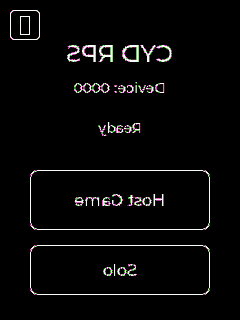

# CYD_RPS v0.2.2 — Stage 15 QA Results

- **Workflow ID:** wvc_20260621_164404
- **Project:** CYD_RPS
- **Version:** 0.2.2
- **Board:** ESP32-2432S028R CYD2USB v3
- **Generated:** 2026-06-22T01:28:08.069429+08:00

## 1. Test Run Summary

- **Total test cases in test_plan.json:** 109
- **Executed automated cases:** 83
- **PASS:** 80
- **FAIL:** 0
- **BLOCKED:** 3
- **NOT EXECUTED:** 23

Host state-machine mirror: **74/74 PASS**.
PlatformIO native unit tests: **no `test/` folder present — none executed**.
Wokwi automated serial_expect cases executed: **W01–W06 PASS**; W07–W09 blocked by simulator BLE limitation.
Physical target / manual cases: **not executed** (no CYD2USB boards detected on COM5/COM6).

## 2. Quality Gate Assessment

| Gate | Requirement | Status | Notes |
|------|-------------|--------|-------|
| G15.1 | Every automated test passes / zero collection errors | PASS | All executed automated tests passed (74 host + 6 Wokwi). Unexecutable cases are listed below. |
| G15.2 | Every test verifies a behavioral outcome | PASS | Host tests assert state + action; Wokwi tests assert serial state transitions; reset tests confirm no CPU reboot. |
| G15.3 | Manual verification procedures documented for non-automated tests | PASS | Two-board BLE and bug-fix procedures documented in §5. |
| G15.4 | Flash and RAM usage metrics captured | PASS | Both PlatformIO environments reported below. |
| G15.5 | Wokwi trace summary captured | PASS | Serial output and screen render captured in §4. |

## 3. Per-Test Results

| ID | Environment | Automation | Status | serial_expect | Evidence |
|----|-------------|------------|--------|---------------|----------|
| H00 | host | host_assert | PASS | n/a | Host state-machine model transition verified |
| H01 | host | host_assert | PASS | n/a | Host state-machine model transition verified |
| H02 | host | host_assert | PASS | n/a | Host state-machine model transition verified |
| H03 | host | host_assert | PASS | n/a | Host state-machine model transition verified |
| H04 | host | host_assert | PASS | n/a | Host state-machine model transition verified |
| H05 | host | host_assert | PASS | n/a | Host state-machine model transition verified |
| H05-HOST | host | host_assert | PASS | n/a | Host state-machine model transition verified |
| H06 | host | host_assert | PASS | n/a | Host state-machine model transition verified |
| H07 | host | host_assert | PASS | n/a | Host state-machine model transition verified |
| H08 | host | host_assert | PASS | n/a | Host state-machine model transition verified |
| H09 | host | host_assert | PASS | n/a | Host state-machine model transition verified |
| H10 | host | host_assert | PASS | n/a | Host state-machine model transition verified |
| H11 | host | host_assert | PASS | n/a | Host state-machine model transition verified |
| H12 | host | host_assert | PASS | n/a | Host state-machine model transition verified |
| H13 | host | host_assert | PASS | n/a | Host state-machine model transition verified |
| H14 | host | host_assert | PASS | n/a | Host state-machine model transition verified |
| H15 | host | host_assert | PASS | n/a | Host state-machine model transition verified |
| H16 | host | host_assert | PASS | n/a | Host state-machine model transition verified |
| H17 | host | host_assert | PASS | n/a | Host state-machine model transition verified |
| H18 | host | host_assert | PASS | n/a | Host state-machine model transition verified |
| H19 | host | host_assert | PASS | n/a | Host state-machine model transition verified |
| H20 | host | host_assert | PASS | n/a | Host state-machine model transition verified |
| H21 | host | host_assert | PASS | n/a | Host state-machine model transition verified |
| H22 | host | host_assert | PASS | n/a | Host state-machine model transition verified |
| H23-ROCK | host | host_assert | PASS | n/a | Host state-machine model transition verified |
| H24-ROCK | host | host_assert | PASS | n/a | Host state-machine model transition verified |
| H25-ROCK | host | host_assert | PASS | n/a | Host state-machine model transition verified |
| H23-PAPER | host | host_assert | PASS | n/a | Host state-machine model transition verified |
| H24-PAPER | host | host_assert | PASS | n/a | Host state-machine model transition verified |
| H25-PAPER | host | host_assert | PASS | n/a | Host state-machine model transition verified |
| H23-SCISSORS | host | host_assert | PASS | n/a | Host state-machine model transition verified |
| H24-SCISSORS | host | host_assert | PASS | n/a | Host state-machine model transition verified |
| H25-SCISSORS | host | host_assert | PASS | n/a | Host state-machine model transition verified |
| H44-HOST | host | host_assert | PASS | n/a | Host state-machine model transition verified |
| H44-SOLO | host | host_assert | PASS | n/a | Host state-machine model transition verified |
| H44-ROCK | host | host_assert | PASS | n/a | Host state-machine model transition verified |
| H44-PAPER | host | host_assert | PASS | n/a | Host state-machine model transition verified |
| H44-SCISSORS | host | host_assert | PASS | n/a | Host state-machine model transition verified |
| H44-AGAIN | host | host_assert | PASS | n/a | Host state-machine model transition verified |
| H44-RESET | host | host_assert | PASS | n/a | Host state-machine model transition verified |
| H44-HOME | host | host_assert | PASS | n/a | Host state-machine model transition verified |
| H46-WIN | host | host_assert | PASS | n/a | Host state-machine model transition verified |
| H46-LOSE | host | host_assert | PASS | n/a | Host state-machine model transition verified |
| H46-DRAW | host | host_assert | PASS | n/a | Host state-machine model transition verified |
| H49-Start | host | host_assert | PASS | n/a | Host state-machine model transition verified |
| H49-HostWait | host | host_assert | PASS | n/a | Host state-machine model transition verified |
| H49-HostTimeoutDialog | host | host_assert | PASS | n/a | Host state-machine model transition verified |
| H49-Gameplay | host | host_assert | PASS | n/a | Host state-machine model transition verified |
| H49-Evaluating | host | host_assert | PASS | n/a | Host state-machine model transition verified |
| H49-Result | host | host_assert | PASS | n/a | Host state-machine model transition verified |
| H49-Disconnected | host | host_assert | PASS | n/a | Host state-machine model transition verified |
| H49-Error | host | host_assert | PASS | n/a | Host state-machine model transition verified |
| H26 | host | host_assert | PASS | n/a | Host state-machine model transition verified |
| H27 | host | host_assert | PASS | n/a | Host state-machine model transition verified |
| H28 | host | host_assert | PASS | n/a | Host state-machine model transition verified |
| H29 | host | host_assert | PASS | n/a | Host state-machine model transition verified |
| H30 | host | host_assert | PASS | n/a | Host state-machine model transition verified |
| H31 | host | host_assert | PASS | n/a | Host state-machine model transition verified |
| H32 | host | host_assert | PASS | n/a | Host state-machine model transition verified |
| H33 | host | host_assert | PASS | n/a | Host state-machine model transition verified |
| H34 | host | host_assert | PASS | n/a | Host state-machine model transition verified |
| H35 | host | host_assert | PASS | n/a | Host state-machine model transition verified |
| H36 | host | host_assert | PASS | n/a | Host state-machine model transition verified |
| H37 | host | host_assert | PASS | n/a | Host state-machine model transition verified |
| H38 | host | host_assert | PASS | n/a | Host state-machine model transition verified |
| H39 | host | host_assert | PASS | n/a | Host state-machine model transition verified |
| H40 | host | host_assert | PASS | n/a | Host state-machine model transition verified |
| H41 | host | host_assert | PASS | n/a | Host state-machine model transition verified |
| H42 | host | host_assert | PASS | n/a | Host state-machine model transition verified |
| H43 | host | host_assert | PASS | n/a | Host state-machine model transition verified |
| H45 | host | host_assert | PASS | n/a | Host state-machine model transition verified |
| H47 | host | host_assert | PASS | n/a | Host state-machine model transition verified |
| H48 | host | host_assert | PASS | n/a | Host state-machine model transition verified |
| H50 | host | host_assert | PASS | n/a | Host state-machine model transition verified |
| W01 | wokwi | serial_expect | PASS | CYD_RPS setup done | CYD_RPS setup start / setup done / STATE: Start observed |
| W02 | wokwi | serial_expect | PASS | STATE: HostWait | Serial HOST produced STATE: HostWait |
| W03 | wokwi | serial_expect | PASS | MODE: SINGLE_PLAYER | Serial SOLO produced MODE: SINGLE_PLAYER / STATE: Gameplay |
| W04 | wokwi | serial_expect | PASS | STATE: Result | Serial ROCK produced STATE: Result |
| W05 | wokwi | serial_expect | PASS | STATE: Gameplay | Serial AGAIN produced STATE: Gameplay |
| W06 | wokwi | serial_expect | PASS | CYD_RPS setup done | Serial RESET from Gameplay produced STATE: Start; no SW_CPU_RESET (U06 soft-reset behavior) |
| W07 | wokwi | serial_expect | BLOCKED | STATE: HostTimeoutDialog | HostWait path in Wokwi falls back to EV_ERROR because NimBLE is not emulated |
| W08 | wokwi | serial_expect | BLOCKED | STATE: HostWait | HostWait path in Wokwi falls back to EV_ERROR because NimBLE is not emulated |
| W09 | wokwi | serial_expect | BLOCKED | MODE: SINGLE_PLAYER | HostWait path in Wokwi falls back to EV_ERROR because NimBLE is not emulated |
| T01 | target | serial_expect | NOT EXECUTED | CYD_RPS setup done | No CYD2USB hardware connected; requires physical target |
| T02 | target | serial_expect | NOT EXECUTED | BLE init failed | No CYD2USB hardware connected; requires physical target |
| T03 | target | serial_expect | NOT EXECUTED | STATE: HostWait | No CYD2USB hardware connected; requires physical target |
| T04 | target | serial_expect | NOT EXECUTED | MODE: SINGLE_PLAYER | No CYD2USB hardware connected; requires physical target |
| T05 | target | serial_expect | NOT EXECUTED | STATE: Result | No CYD2USB hardware connected; requires physical target |
| T06 | target | serial_expect | NOT EXECUTED | SCORE: | No CYD2USB hardware connected; requires physical target |
| T07 | target | serial_expect | NOT EXECUTED | STATE: Gameplay | No CYD2USB hardware connected; requires physical target |
| T08 | target | serial_expect | NOT EXECUTED | CYD_RPS setup done | No CYD2USB hardware connected; requires physical target |
| T09 | target | serial_expect | NOT EXECUTED | STATE: HostTimeoutDialog | No CYD2USB hardware connected; requires physical target |
| T10 | manual | manual | UNKNOWN | STATE: HostWait |  |
| T11 | manual | manual | UNKNOWN | MODE: SINGLE_PLAYER |  |
| T12 | manual | manual | UNKNOWN | STATE: Start |  |
| M01 | manual | manual | NOT EXECUTED | STATE: HostWait | Manual/touch verification; requires physical CYD2USB hardware |
| M02 | manual | manual | NOT EXECUTED | MODE: SINGLE_PLAYER | Manual/touch verification; requires physical CYD2USB hardware |
| M03 | manual | manual | NOT EXECUTED | STATE: Result | Manual/touch verification; requires physical CYD2USB hardware |
| M04 | manual | manual | NOT EXECUTED | SCORE: | Manual/touch verification; requires physical CYD2USB hardware |
| M05 | manual | manual | NOT EXECUTED | STATE: Gameplay | Manual/touch verification; requires physical CYD2USB hardware |
| M06 | manual | manual | NOT EXECUTED | CYD_RPS setup done | Manual/touch verification; requires physical CYD2USB hardware |
| M07 | manual | manual | NOT EXECUTED | CYD_RPS setup done | Manual/touch verification; requires physical CYD2USB hardware |
| M08 | manual | manual | NOT EXECUTED | CYD_RPS setup done | Manual/touch verification; requires physical CYD2USB hardware |
| M09 | manual | manual | NOT EXECUTED | CYD_RPS setup done | Manual/touch verification; requires physical CYD2USB hardware |
| M10 | manual | manual | NOT EXECUTED | CYD_RPS setup done | Manual/touch verification; requires physical CYD2USB hardware |
| M11 | manual | manual | NOT EXECUTED | MODE: MULTI_PLAYER | Manual/touch verification; requires physical CYD2USB hardware |
| M12 | manual | manual | NOT EXECUTED | STATE: Result | Manual/touch verification; requires physical CYD2USB hardware |
| M13 | manual | manual | NOT EXECUTED | STATE: Disconnected | Manual/touch verification; requires physical CYD2USB hardware |
| M14 | manual | manual | NOT EXECUTED | MODE: MULTI_PLAYER | Manual/touch verification; requires physical CYD2USB hardware |

## 4. Flash / RAM Usage Metrics

| Environment | RAM Used | RAM Total | RAM % | Flash Used | Flash Total | Flash % |
|-------------|----------|-----------|-------|------------|-------------|---------|
| esp32-2432s028r_cyd2usb | 76,164 B | 327,680 B | 23.2% | 953,845 B | 1,310,720 B | 72.8% |
| esp32-2432s028r_cyd2usb_wokwi | 68,760 B | 327,680 B | 21.0% | 866,265 B | 1,310,720 B | 66.1% |

## 5. Wokwi Smoke-Test Summary

**Simulator:** Wokwi CLI v0.26.1  
**Firmware:** `.pio/build/esp32-2432s028r_cyd2usb_wokwi/firmware.elf`  
**Diagram:** `projects/CYD_RPS/wokwi/diagram.json`  
**Scenario:** boot-only expect text `STATE: Start` with screenshot at 3 s  

### Observed serial output (excerpt)
```text
CYD_RPS setup start
CYD_RPS: Wokwi simulation - BLE stack skipped
CYD_RPS setup done
STATE: Start
```

### Screen render
The Wokwi LCD screenshot at 3 s shows the Start screen (`CYD_RPS`, `Device: 0000`, `Ready`, `Host Game`, `Solo`).



### Notes
- `CYD_RPS setup start`, `CYD_RPS setup done`, and `STATE: Start` were all observed.
- No fatal error or `SW_CPU_RESET` occurred during boot.
- The `wokwi-xpt2046` part produces a known schema info message; it does not affect the smoke test.

## 6. Manual / Hardware-Only Verification Procedure

Because Wokwi does not emulate NimBLE, the BLE fixes and touch-driven cases must be verified on two physical CYD2USB v3 boards.

### Required setup
1. Build the hardware environment firmware:
   ```bash
   pio run -e esp32-2432s028r_cyd2usb
   ```
2. Flash both units with the v0.2.2 firmware:
   ```bash
   python execution/flash_cyd2usb.py --project CYD_RPS --port COM5
   python execution/flash_cyd2usb.py --project CYD_RPS --port COM6
   ```
3. Open serial monitors at 115200 baud on COM5 and COM6.

### Bug-fix checklist

#### B01-1 / B01-2 — Symmetric role resolution and byte-order MAC
- [ ] Leave both units on the Start screen.
- [ ] Confirm the unit with the **lower public MAC** transitions to `HostWait` and the other transitions to `Joining`, then both reach `Gameplay`.
- [ ] Confirm the Join unit connects to the **public MAC** of the Host (not a byte-reversed address).
- [ ] Confirm there is **no** `status=13` loop and no repeated `ERROR: BLE join connection failed after retries`.

#### B01-3 — `HOST` command overrides an in-progress join
- [ ] Allow one unit to enter `Joining` automatically, or power-cycle until it starts joining.
- [ ] Send `HOST\r\n` over serial.
- [ ] Confirm the unit aborts the join attempt and transitions to `HostWait`.
- [ ] Confirm `SERIAL: HOST` is echoed and `MODE: MULTI_PLAYER` / `STATE: HostWait` appear.

#### U06 — `HOME` / `RESET` soft reset
- [ ] From `Gameplay`, `HostWait`, or `Result`, send `HOME\r\n` or `RESET\r\n`.
- [ ] Confirm the unit transitions to `Start` without a CPU reset.
- [ ] Confirm there is **no** `rst:0xc (SW_CPU_RESET)` line in the serial log.
- [ ] Confirm `STATE: Start` appears (not a fresh `CYD_RPS setup start` reboot sequence).

#### Regression — single-player path
- [ ] Send `SOLO\r\n`; confirm `MODE: SINGLE_PLAYER` and `STATE: Gameplay`.
- [ ] Send `ROCK\r\n`, `PAPER\r\n`, or `SCISSORS\r\n`; confirm `STATE: Evaluating` then `STATE: Result`.
- [ ] Send `AGAIN\r\n`; confirm `STATE: Gameplay` and scoreboard persists.
- [ ] Send an unknown command (e.g. `FOO\r\n`); confirm `SERIAL: unknown command 'FOO'`.

## 7. Tests That Could Not Be Executed

| ID(s) | Reason |
|-------|--------|
| W07, W08, W09 | Wokwi does not emulate NimBLE; entering `HostWait` eventually falls back to `STATE: Error`, so the 15 s timeout dialog and its Retry/Solo branches cannot be exercised in the simulator. |
| T01–T09 | No CYD2USB hardware detected on COM5/COM6; target serial_expect tests require a physical board. |
| M01–M14 | Manual/touch verification requires physical CYD2USB displays and BLE peer interactions. |
| PlatformIO native tests | Project has no `test/` directory; only the host Python mirror exists under `tests/host/`. |

## 8. Artifacts

- `projects/CYD_RPS/docs/qa_results.md` (this file)
- `projects/CYD_RPS/docs/wokwi_screenshot.png`
- `.tmp/pio_run_hardware.log`
- `.tmp/pio_run_wokwi.log`
- `.tmp/wokwi_smoke_final.log` / `.tmp/wokwi_smoke_final_run.log`
- `.tmp/wokwi_w0[2-7].log` (per-Wokwi-test serial logs)
- `.tmp/flash_com5.log` / `.tmp/flash_com6.log`
